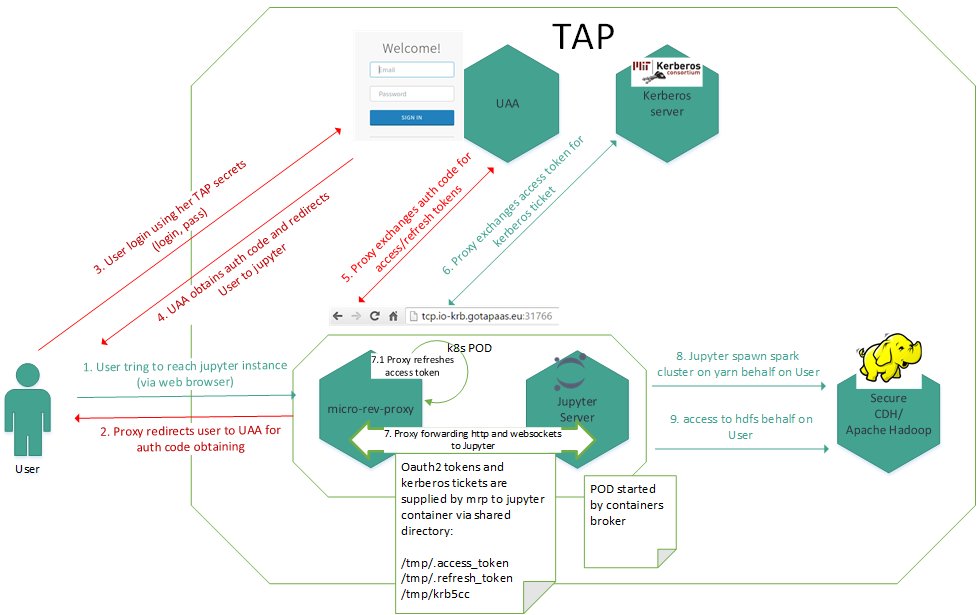

# Micro-reverse-proxy.
Reverse proxy for hiding/guard unsecured web applications. Solution based on [openresty](https://openresty.org) project.

##OVERVIEW


## DESCRIPTION
Check user access and forward http/websockets requests to guarded web application.
Verification on the basis of JWT token, obtained from "Authorization:" header. Checks token signature, expiration time
and user_name (if user_name equals the value from USER_ID environment variable).

## BUILDING
Building docker image containing openresty with required lua libraries:
```
 https://github.com/SkyLothar/lua-resty-jwt (JWT functions)
 https://github.com/doujiang24/lua-resty-rsa (RSA encryption functions)
```

Before start building you have to get base image. Bellow you can find link to repo with scripts that facilitate that.:
```
https://github.com/intel-data/tap-base-images/tree/master/binary/binary-jessie
```

Docker image is build in two steps:

* First, prepare environment for compiling openresty. (docker run starts compilation, binaries goes to target dir.)
```
docker build -t mrp_build -f build/Dockerfile .
docker run --rm --volume="$PWD/target:/opt" --volume="$PWD/target:/target" -t mrp_build
```
* Second, assemble image with openresty binaries and required dependecies
```
docker build -t mrp -f Dockerfile .
```

## PROXY CONFIGURATION

### mrp-module configuration
Reference configuration of proxy, with **mrp-module**, can be found in [conf/nginx.conf](conf/nginx.conf). 

**mrp-module** recognizes following switches:
* $mrp_kerberos - switch on/off kerberos authentication
* $mrp_sharing_auth_tokens - switch on/off oauth2 access/refresh tokens sharing mechanism
* $mrp_authorization - switch on/off authorization, if it is off, access is allowed for all users who hold valid access token   

For more flexibility, i.e when you what inject some custom authorization logic you can configure the proxy excluding **mrp-module** [conf/generic.nginx.conf](conf/generic.nginx.conf).

Environment variables:
*  JWT_PUBLIC_KEY - optional, uaa public key (i.e.: '-----BEGIN PUBLIC KEY-----\nMIIBIjANBgkqh...\n-----END PUBLIC KEY-----')
*  JWT_PUBLIC_KEY_FILE - optional, uaa public key file location on local filesystem
*  USER_ID - uaa user id authorized for access to guarded application
*  NB_USER - optional, user name that nginx processes run with (default: vcap)
*  NB_UID - optional, user id that nginx processes run with (default: 1000)
*  OAUTH_CLIENT_ID - oauth client id
*  OAUTH_CLIENT_SECRET - oauth client secret
*  UAA_ADDRESS - uaa address (i.e.: http://uaa.some.domain)
*  UAA_AUTHORIZATION_URI - optional, i.e.: https://login.uaa.some.domain/oauth/authorize (default: UAA_ADDRES/oauth/authorize)
*  SESSION_ID_SEED - seed used for generating session id

Shared volumes:
*  /root/conf - nginx configuration, place to put nginx.conf
*  /root/logs - directory for nginx error, access logs
*  /libs - directory for tap-auth module code
*  /etc/krb5.conf - kerberos client configuration
*  /etc/krb5.cacert.pem certificate used in pre-authentication phase
*  /tmp - directory that holds obtained kerberos credentials (krb5cc)

## HOW TO RUN PROXY?
on your local machine.
```
docker run -e JWT_PUBLIC_KEY=$'-----BEGIN PUBLIC KEY-----\nMIIBIjANBgkqh...\n-----END PUBLIC KEY-----' -e USER_ID='jojo' --volume="$PWD/conf:/root/conf" --volume="$PWD/logs/:/root/logs" --volume="$PWD/libs:/libs" --volume="$PWD/tmp:/tmp" --volume="/etc/krb5.conf:/etc/krb5.conf" --volume="/var/krb5kdc/cacert.pem:/var/krb5kdc/cacert.pem" --net=poligonnet --ip 172.18.0.6 --dns=172.17.0.1 -h nginx.localnet --name "nginx" -p 8081:8080 -d -t mrp
```
or
```
docker run -e SESSION_ID_SEED='somesecretphrase' -e UAA_ADDRESS='http://uaa.localnet:8080' -e JWT_PUBLIC_KEY_FILE='/tmp/key.pem' -e OAUTH_CLIENT_ID='nginx' -e OAUTH_CLIENT_SECRET='nginxsecret' -e USER_ID='jojo' --volume="$PWD/conf:/root/conf" --volume="$PWD/logs/:/root/logs" --volume="$PWD/libs:/libs" --volume="$PWD/tmp:/tmp" --volume="/etc/krb5.conf:/etc/krb5.conf" --volume="/var/krb5kdc/cacert.pem:/var/krb5kdc/cacert.pem" --net=poligonnet --ip 172.18.0.6 --dns=172.17.0.1 -h nginx.localnet --name "nginx" -p 8081:8080 -d -t mrp
```
or
```
docker run -e SESSION_ID_SEED='somesecretphrase' -e UAA_ADDRESS='http://uaa.localnet:8080' -e OAUTH_CLIENT_ID='nginx' -e OAUTH_CLIENT_SECRET='nginxsecret' -e USER_ID='jojo' --volume="$PWD/conf:/root/conf" --volume="$PWD/logs/:/root/logs" --volume="$PWD/libs:/libs" --volume="$PWD/tmp:/tmp" --volume="/etc/krb5.conf:/etc/krb5.conf" --volume="/var/krb5kdc/cacert.pem:/var/krb5kdc/cacert.pem" --net=poligonnet --ip 172.18.0.6 --dns=172.17.0.1 -h nginx.localnet --name "nginx" -p 8081:8080 -d -t mrp
```
For correctness verification you can use this example commands:
```
curl -H "Authorization: Bearer `uaac context jojo | grep access_token | sed -e 's/access_token\:\ //' | sed -e 's/^[ \t]*//'`" -X GET http://nginx.localnet:8080
wscat -H "Authorization: Bearer `uaac context jojo | grep access_token | sed -e 's/access_token\:\ //' | sed -e 's/^[ \t]*//'`" -c ws://nginx.localnet:8080/websockets
```

### How to run unit tests?
[Manual](unittests/README.md)
